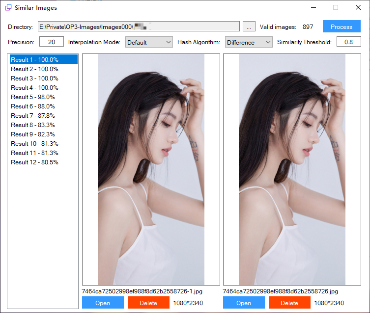
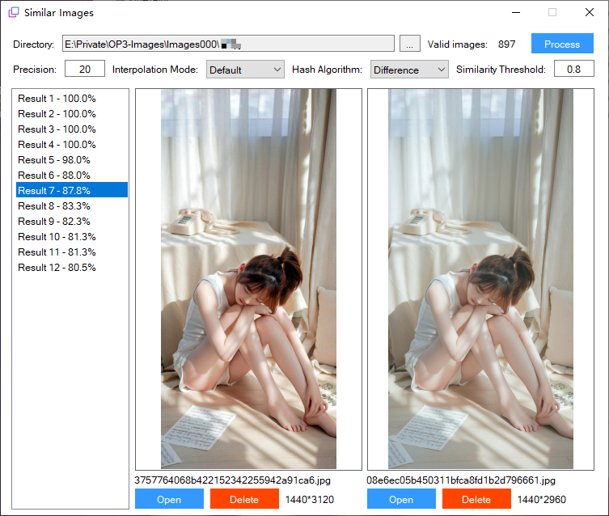
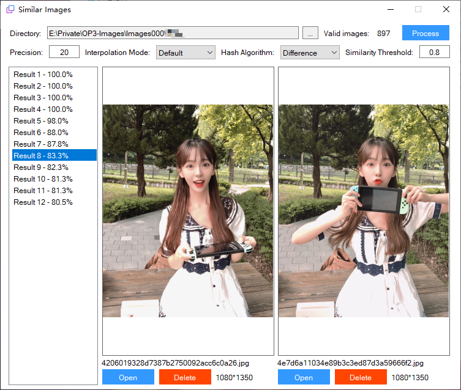

# ImageSimilarityDetection-UI
Find similar images in the directory by aHash/dHash/pHash.

## Supported formats
.jpg; .jpeg; .png

## Purpose 
Reduce duplication in an image folder.

## Principle
1. Implement aHash, dHash, pHash to generate the fingerprint of images.
2. Calculate the hamming distance between every two images.
3. Export image pairs with high similarity(hamming distance).

## Usage
1. Get `SimilarImages.exe` in the following ways.
  - Build this project in Visual Studio.
  - Find it in [_Output](_Output).
  - Find it in [Releases](https://github.com/Roy0309/ImageSimilarityDetection-UI/releases).
  
2. Double click `SimilarImages.exe`. Select an image folder and set arguments (the default is suggested arguments). Enjoy!

## Output
1. Compare two identical images.
  

2. Compare two images with different resolution.
  

3. Compare two images with similar content.
  